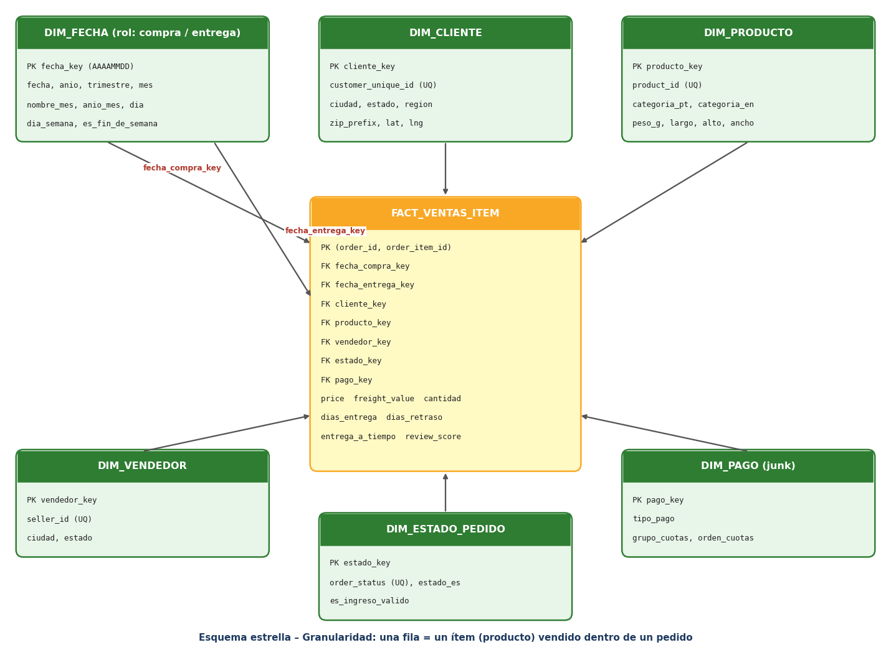
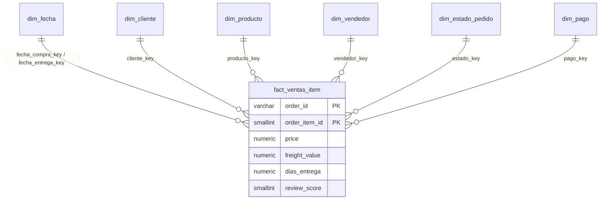
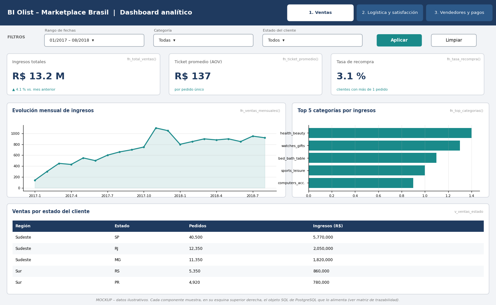
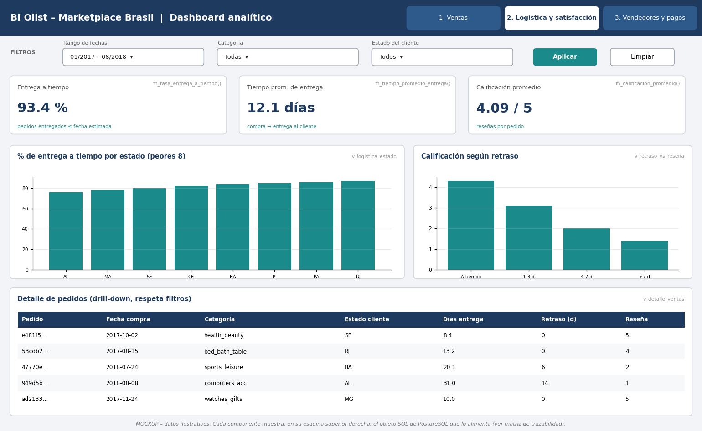
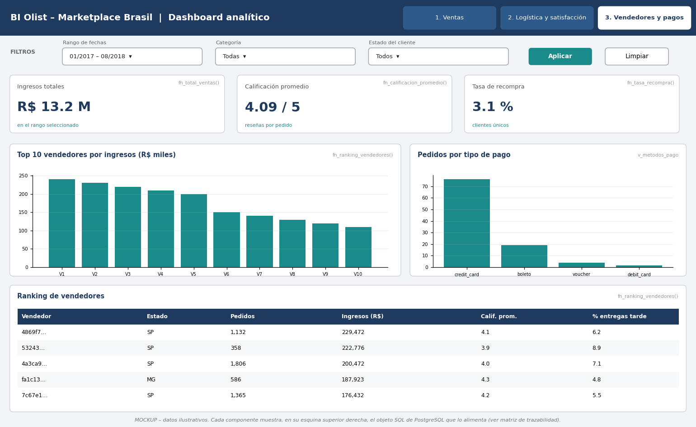

# BI Olist – Fase 2: Modelo dimensional en PostgreSQL (Docker)

Pipeline analítico sobre el dataset público **Brazilian E-Commerce de Olist** (Kaggle): limpieza con Python, almacenamiento en **PostgreSQL (Docker)**, **modelo estrella**, **vistas y funciones SQL** que alimentarán un dashboard, y **mockups** con matriz de trazabilidad.

```
Dataset Kaggle (9 CSV) → Limpieza y transformación (Python) → PostgreSQL (Docker)
      → Modelo dimensional (esquema dw) → Vistas / Funciones SQL → Aplicación analítica (mockup)
```

> **Pregunta de la fase:** ¿cómo voy a almacenar, consultar y presentar la información?
> **Almacenar:** staging (`stg`) + modelo estrella (`dw`) en PostgreSQL. **Consultar:** validaciones, vistas y funciones SQL con filtros.
> **Presentar:** dashboard diseñado en 3 mockups, cada componente enlazado a un objeto SQL (matriz de trazabilidad).

## Ejecución rápida (3 pasos)

**Requisitos:** [Docker Desktop](https://www.docker.com/products/docker-desktop) en ejecución y los 9 CSV de Kaggle en `data/raw/` (ver [`data/raw/LEEME.md`](data/raw/LEEME.md)).

```bash
git clone <URL-DE-TU-REPOSITORIO>
cd Fase2_BI_Olist
# (copia aqui los 9 CSV en data/raw/)
docker compose run --rm etl
```

Ese comando levanta PostgreSQL, espera a que esté listo y ejecuta **todo** en orden: limpieza → staging → modelo → carga → validaciones → vistas/funciones → pruebas. Tarda unos 2–4 minutos la primera vez. Al terminar genera la evidencia en `evidencias/`.

| Dato de conexión | Valor |
|---|---|
| Host | `localhost` |
| Puerto | `5432` (configurable con `DB_PORT`, ver abajo) |
| Base de datos | `bi_database` |
| Usuario / Contraseña | `bi_user` / `bi_password` |

**¿El puerto 5432 está ocupado** (por ejemplo, ya tienes otro PostgreSQL instalado)? Copia `.env.example` como `.env` y cambia `DB_PORT=5434`; luego conéctate a ese puerto.

### Comandos útiles
```bash
docker compose ps                    # estado del contenedor (evidencia: debe verse bi-postgres "healthy")
docker compose logs db               # registros de PostgreSQL
docker compose down                  # apaga (los datos se conservan en el volumen)
docker compose up -d db              # vuelve a encender solo la base
docker compose down -v               # apaga y BORRA los datos (empezar de cero)
docker exec -it bi-postgres psql -U bi_user -d bi_database     # consola SQL
```
Para repetir todo desde cero: `docker compose down -v` y luego `docker compose run --rm etl`.

## Estructura del repositorio
```
├── docker-compose.yml        # PostgreSQL 17 + servicio "etl" (pipeline)
├── docker/
│   ├── etl/Dockerfile        # Python + cliente psql
│   └── run_pipeline.sh       # orquesta todo el flujo
├── python/etl_olist.py       # limpieza, transformación y carga a staging
├── sql/
│   ├── 01_staging.sql              # tablas de staging (esquema stg)
│   ├── 02_modelo_dimensional.sql   # hechos, dimensiones, PK y FK (esquema dw)
│   ├── 03_carga_dimensiones_hechos.sql
│   ├── 04_validaciones.sql         # conteos, integridad, nulos y totales
│   ├── 05_vistas_funciones.sql     # objetos que alimentan el dashboard
│   └── 06_pruebas_objetos.sql
├── docs/                     # diagrama estrella, matriz de trazabilidad, log de transformaciones, guía en Word
├── mockup/                   # 3 mockups del dashboard
├── evidencias/               # salidas del pipeline y capturas
└── data/raw, data/limpio     # CSV (no versionados; ver data/raw/LEEME.md)
```

## Limpieza y transformaciones
Cada paso queda registrado en [`docs/log_transformaciones.csv`](docs/log_transformaciones.csv) (se regenera al ejecutar el pipeline). Principales decisiones:
- Fechas convertidas a `datetime`; período de análisis **2017-01-01 a 2018-08-31** (se descartan 2016 y sep–oct 2018 por tener muy pocos pedidos).
- Se descartan pedidos con fecha de entrega anterior a la compra; los pedidos no entregados conservan fecha de entrega nula.
- Una fila por pedido en pagos (tipo principal = el de mayor valor) y en reseñas (la más reciente).
- Categorías unidas con su traducción al inglés; 610 productos sin categoría → `sin_categoria`.
- Textos normalizados (minúsculas, sin acentos); códigos postales como texto; geolocalización reducida a un punto por código postal.
- Outliers de `price` detectados (IQR) y **conservados**: son precios altos legítimos.

## Modelo dimensional (esquema `dw`)


**Granularidad:** *una fila de `dw.fact_ventas_item` representa un ítem (producto) vendido dentro de un pedido*, identificado por `(order_id, order_item_id)`.



- **Tabla de hechos:** `fact_ventas_item` con medidas aditivas (`price`, `freight_value`, `cantidad`) y derivadas que se promedian, no se suman (`dias_entrega`, `dias_retraso`, `entrega_a_tiempo`, `review_score`).
- **Dimensiones:** `dim_fecha` (con 2 roles: compra y entrega), `dim_cliente` (por `customer_unique_id`), `dim_producto`, `dim_vendedor`, `dim_estado_pedido` y `dim_pago` (dimensión basura: tipo de pago + grupo de cuotas).
- `order_id` es una dimensión degenerada. Clave primaria compuesta y 7 claves foráneas.
- La reseña y los tiempos de entrega son datos **del pedido** repetidos en cada ítem, por eso las funciones agrupan por `order_id` antes de promediar (`dw.fn_base_pedidos`).

## Validaciones (resultados esperados)
`evidencias/validaciones.txt` y `evidencias/pruebas_objetos.txt` deben mostrar:

| Control | Esperado |
|---|---|
| Filas: `fact_ventas_item` / `dim_cliente` / `dim_producto` / `dim_vendedor` / `dim_fecha` / `dim_estado_pedido` / `dim_pago` | 112,279 / 95,774 / 32,951 / 3,095 / 1,461 / 8 / 25 |
| Ítems en staging vs. filas en hechos | diferencia **0** |
| Claves huérfanas (`sin_cliente`, `sin_producto`, `sin_vendedor`, …) | todas **0** |
| Duplicados de la clave del hecho | **0 filas** |
| `price` y `freight_value` nulos | **0** |
| Ingresos totales / ticket promedio | 13,449,529.68 / 137.37 |
| Entrega a tiempo / calificación promedio / recompra | 93.21 % / 4.12 / 3.03 % |

## Vistas y funciones SQL
- **Funciones** (reciben `desde`, `hasta`, `categoría`, `estado`; `NULL` = todos): `fn_total_ventas`, `fn_ticket_promedio`, `fn_tasa_entrega_a_tiempo`, `fn_tiempo_promedio_entrega`, `fn_calificacion_promedio`, `fn_tasa_recompra`, `fn_ventas_mensuales`, `fn_top_categorias`, `fn_ranking_vendedores`.
- **Vistas:** `v_pedidos`, `v_ventas_mensual`, `v_ventas_categoria`, `v_ventas_estado`, `v_logistica_estado`, `v_retraso_vs_resena`, `v_metodos_pago`, `v_detalle_ventas`.

```sql
SELECT dw.fn_total_ventas();
SELECT dw.fn_total_ventas('2017-01-01','2017-12-31','health_beauty','SP');
SELECT * FROM dw.fn_top_categorias(NULL, NULL, NULL, 5);
SELECT * FROM dw.v_ventas_mensual;
```

## Mockup del dashboard
| Ventas | Logística | Vendedores y pagos |
|---|---|---|
|  |  |  |

Filtros globales: fecha (F), categoría (C) y estado del cliente (E).

## Matriz de trazabilidad (Mockup → KPI → Filtros → SQL)
| Componente | Pregunta/KPI | Filtros | Origen de datos | Objeto SQL |
|---|---|---|---|---|
| Tarjeta K1: Ingresos totales | P1 · Ingresos por ventas | F, C, E | Fact + dim_fecha, dim_producto, dim_cliente, dim_estado_pedido | dw.fn_total_ventas() |
| Tarjeta K2: Ticket promedio | P1, P5 · Ticket promedio (AOV) | F, C, E | Fact + dimensiones (pedidos únicos) | dw.fn_ticket_promedio() |
| Tarjeta K3: Tasa de recompra | P5 · Tasa de recompra | F, C, E | Fact + dim_cliente (customer_unique_id) | dw.fn_tasa_recompra() |
| Gráfico G1: Línea de ingresos mensuales | P1 · Evolución de ventas por mes | F, C, E | Fact + dim_fecha | dw.fn_ventas_mensuales() |
| Gráfico G2: Barras Top categorías | P1 · Categorías con más ingresos | F, E | Fact + dim_producto | dw.fn_top_categorias() |
| Tabla T1: Ventas por estado/región | P1 · Estados que generan más ingresos | — | Fact + dim_cliente | dw.v_ventas_estado |
| Tarjeta K4: Entrega a tiempo | P2, P3 · Tasa de entrega a tiempo | F, C, E | Fact (entrega_a_tiempo) + dimensiones | dw.fn_tasa_entrega_a_tiempo() |
| Tarjeta K5: Tiempo prom. de entrega | P2 · Tiempo promedio de entrega | F, C, E | Fact (dias_entrega) + dimensiones | dw.fn_tiempo_promedio_entrega() |
| Tarjeta K6: Calificación promedio | P3, P4 · Calificación promedio | F, C, E | Fact (review_score) + dimensiones | dw.fn_calificacion_promedio() |
| Gráfico G3: % a tiempo por estado | P2 · Estados con más retrasos | — | Fact + dim_cliente | dw.v_logistica_estado |
| Gráfico G4: Calificación vs retraso | P3 · Efecto del retraso en la satisfacción | — | Fact (dias_retraso, review_score) | dw.v_retraso_vs_resena |
| Tabla T2: Detalle de pedidos | P2, P3 · Drill-down de pedidos | F, C, E | Fact + todas las dimensiones | dw.v_detalle_ventas |
| Gráfico G5: Pedidos por tipo de pago | P5 · Medios de pago preferidos | — | Fact + dim_pago | dw.v_metodos_pago |
| Gráfico G6: Top vendedores | P4 · Vendedores que concentran ingresos | F | Fact + dim_vendedor | dw.fn_ranking_vendedores() |
| Tabla T3: Ranking de vendedores | P4 · Ingresos y reputación por vendedor | F, estado vendedor | Fact + dim_vendedor | dw.fn_ranking_vendedores() |
| Filtros globales (fecha, categoría, estado) | Todos | — | dim_fecha, dim_producto, dim_cliente | Parámetros de las funciones fn_* |

(Archivo fuente: [`docs/matriz_trazabilidad.csv`](docs/matriz_trazabilidad.csv))

## Solución de problemas
| Síntoma | Solución |
|---|---|
| `Cannot connect to the Docker daemon` | Abre Docker Desktop y espera a que indique que está en ejecución. |
| `port is already allocated` / el puerto 5432 está ocupado | Define `DB_PORT=5434` en `.env` y vuelve a ejecutar. |
| `FALTA data/raw/...csv` | Copia los 9 CSV de Kaggle en `data/raw/` (ver `data/raw/LEEME.md`). |
| `password authentication failed` tras cambiar credenciales | `docker compose down -v` y vuelve a ejecutar (borra los datos). |
| Error de `^M` / `bad interpreter` en el script | El repositorio fuerza finales de línea LF con `.gitattributes`; vuelve a clonar. |

## Fuente de datos y créditos
Olist, *Brazilian E-Commerce Public Dataset* (Kaggle, licencia CC BY-NC-SA 4.0). Los CSV no se redistribuyen en este repositorio.
